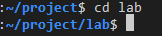
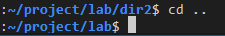

Instructions

Step 1: Open Terminal in your VS code editor.  

Step 2: Type the command mkdir lab and press Enter  
 

Step 3: Change to the lab directory by typing cd lab and pressing Enter  
 

Step 4: Type the command touch file1.txt and press Enter to create a file named file1.txt  
 

Step 5: Type the command mkdir dir1 and press Enter  
 

Step 6: Type the command mv file1.txt dir1/ and press Enter to move file1.txt to the dir1 directory  
 

Step 7: Type the command touch file2.txt and press Enter to create a file named file2.txt  
 

Step 8: Type the command mkdir -p dir2/dir3 and press Enter. We're using the -p flag to create the parent directories if they do not exist. In this case it will create the dir2 directory and then create the dir3 directory inside of dir2.  
 

Step 9: Type the command mv file2.txt dir2/dir3/ and press Enter to move file2.txt to the dir3 directory  
 

Step 10: Change to the dir2 directory by typing cd dir2  
 

Step 11: Type the command touch file3.txt and press Enter to create a file named file3.txt  
 

Step 12: Type the command mv file3.txt ../ and press Enter to move file3.txt to the lab directory  
 

Step 13: Type the command cd .. and press Enter to navigate back to the lab directory  
 

Step 14: Type the command cd dir1 and press Enter.  
 

Step 15: Type the command ls -l and press Enter. Note how many files and directories are in the dir1 directory. (1 file called file1.txt)  
 

Step 16: Type the command cd ../dir2 and press Enter.  
 

Step 17: Type the command ls -l and press Enter. Note how many files and directories are in the dir2 directory. (1 directory called dir3)  
 

Step 18: Type the command cd dir3 and press Enter.  
 

Step 19: Type the command ls -l and press Enter. Note how many files and directories are in the dir3 directory. (1 file called file2.txt)  
 

