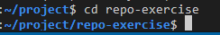
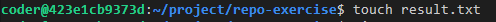

Step 1: Create a new repository on your Github account named "repo-exercise". Ensure that "Add a README file" is selected.

Step 2: Open the Terminal and authenticate using gh (Github CLI):
"gh auth login"

Step 3: Create an authentication token in your Github account with specified scopes given in the terminal. Copy it from Github and paste it. Verify authorization was successful.

Step 4: Clone the repository using its GitHub CLI.
"gh repo clone <YOUR USERNAME>/<REPOSITORY-NAME> "  

Step 5: Move to the repo directory by using "cd <REPOSITORY-NAME>" 

Step 6: add the"result.txt" to the repository folder on your local machine 

Step 7: In the Git terminal, run the "git status" command.

Step 8: Verify that the output shows "result.txt" as an untracked file. 

Step 9: Run the command "git add result.txt" 

Step 10: Run the "git status" command again.

Step 11: Verify that the output shows "result.txt" as a tracked file. 

Step 12: Next, run the "git commit" command and specify the commit message as "Successful exercise" 

Step 13: Next, run the "git push" command. 

Step 14:  On Github, go to your repository page. Verify that the "result.txt" file is listed. You may need to refresh the page to see the changes.  

