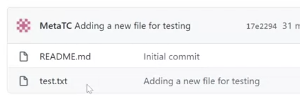

## Git
version control system for tracking changes to projects

<br>

## GitHub 
Cloud-based hosting service that lets you manage Git repositories from a user interface


<br>

## Connecting to GitHub via HTTPS
A Personal Access Token is a special password that you use instead of your actual account password. When you're finished using the token, you can revoke it so that it can no longer be used. It is also possible to set an expiry time for the token. This helps to keep your account secure.
you will be using your Github account to genrate a key.

<br>

## Connecting to GitHub via SSH
If you plan to use Github from your local device, the recommended way to authenticate is using Secure Shell, or SSH for short. This requires the creation of keys: a public and a private key. The advantage of using SSH is that you don't need to enter in your credentials (password) when interacting with the remote repository.
you will need to use the Git Bash terminal.

<br>

## GitHub repository
every repository you create will have a single main branch at the start.
This is also known as the main line.

<br>

### Clone  :
First is the HTTPS, which contains the HTTPS URL of the repository and I can use this to pull by using the git clone command.
<br>

this is how to use HTTPS to clone<br>


<br>

Next, there is an option for SSH but to use that, I have to set up my SSH keys and assign them to the user accounts. <br>

Finally, I have the GitHub CLI option. there are additional options for GitHub Desktop if I would like to use that, or I can also download a compressed zip file containing all the files and folder structures.
<br><br>

### .git folder

folder called .git, which is a hidden folder used to track all the changes. In Linux, any folder starting with a dot is a hidden folder. This folder is automatically created when you create a repository. 

<br><br>


## git work flow

1. Modified : <br>
adding removing and updating any file inside the repository is considered a modified state. 


2. Staged : <br>
Git knows the file has changed, but does not track it. This is where the staging state comes in. In order for Git to track a file, it needs to be put in the staged area. Once added, any modifications are tracked. Which offers a security blanket prior to committing the changes. 


3. Committed : <br>
Committing a file in Git is like a save point. Git will save the file, and have a snapshot of the current changes. 

<br><br>

## Add and commit

All the latest files on my local machine are exactly the same as the server that everyone commits to. Git status also tells me that I have nothing to commit and that my working tree is clean. <br>


<br>

I added a file called test.txt, using the command git status. git is telling me that I have an untracked file which is test.txt. <br>


<br>

The purpose of the git add command is letting git to know that I want to track this file, and that it will be included as part of my commit. <br>
notice it asking if I want to revert those changes. <br>


<br>

I can use the git restore command Running the command will unstage the file.
file is back to an untracked status. <br>


<br>

So once again I'll add the file using git add. The file is back in a tracked state. <br> 


<br>

git commit command you can use the flag -m which stands for message, to type in a message which will be attached to the commit. <br>


<br>

this tells me to use git push to publish my local commits All of these changes are on my local machine, and they will only be uploaded to the remote server when I run the push command. <br>


<br><br>

## Branch

Create a new branche, git branch just creates a branch. But git checkout -B moves me from the main branch into the branch that I created. <br>
To verify that I've been moved between branches run the git branch command. <br>


<br><br>

## Pull
The purpose of a pull request is to obtain a peer review of changes made to the branch. to validate that the changes are correct. many teams will have conditions around the integration tests.<br>
These conditions will usually include validating that the standards have been met for merging back into the main line, Once I've committed the new file, I need to push my changes up to the remote repository with git push. <br> <br>

-u origin This means that I'm only going to get updates from the upstream, which in this case will be the main branch. <br>
The result of this is that the origin won't be my main branch anymore. Instead, it's feature lesson. <br>


 <br>

A pull request lets the team know that I've made new changes that I want them to review and that I also want to approve or request changes to the actual pull request itself. <br><br>

on the GitHub UI I'm comparing this with the main branch. Create pull request, the team will then review the changes and either approve or decline them. Once approved, you can then merge your changes to the main branch. This is much cleaner than everyone working off the main branch. <br>


<br><br>

Check main branch. Then run the git pull command shows the latest changes that were merged in from the feature branch. Notice that the test2.txt file is now available and merged to the main branch. <br>


<br>

* When you want to copy a project to your local device, you need to either perform a clone if it's the first time or pull it to get the latest changes. <br>

* You can then make changes to the project and push those changes back to the server. Other users working on the code won't see those changes on their local machines unless they pull the latest changes from the server.  <br>

* One of the advantages you can work offline and then commit your changes when you are ready. <br>

<br><br>
## Local and remote

create a new repo (local repo)<br>


step back to my-first-repo and check if its connected to a remote server or github<br>


connect the first repo which is a remote repo on github to the seconde repo that is local on your device<br>


git pull to pull the remote repo, you need to set up a branch that matches the main repo (first repo) so you can be able to access the content <br>


## Push and Pull
push from my local repo to the remote repo if there is no conflict the files will be outo merged<br>
<br>



when we checked test.txt using cat command it was empty, so we used git pull and it says there has been an update to test.txt<br>


<br><br>

## Resolving conflicts
A merge conflict example is when two developers work on their dependent branches. Both developers are working on the same file called Feature.js. Each of their tasks is to add a new feature to an existing method. Developer 1 has a branch called feature1, and developer 2 has a branch called feature2. 

Developer 1 pushes the code with the changes to the remote repository. Developer 2 pushes their changes.

In order to merge, Developer 2 needs to see and compare the changes from Developer 1.

the team's conflicting changes occurred in feature 1 and 2 branches. Developer 2 now wants to see the change that is causing the conflict.

```bash
 git log --merge

commit 79bca730b68e5045b38b96bec35ad374f44fe4e3 (HEAD -> feature2)
Author: Developer 2 
<developer2@demo.com>
Date:   Sat Jan 29 16:55:40 2022 +0000

    chore: add feature 2

commit 678b0648107b7c53e90682f2eb8103c59f3cb0c0
Author: Developer 1 
<developer1@demo.com>
Date:   Sat Jan 29 16:53:40 2022 +0000

    chore: add feature 1

```


The only difference is the wording in the return statement. Developer 1 added 'too much,' but Developer 2 added 'way too much. Everything else is identical in terms of merging and it's a pretty easy fix. Developer 2 removes the markers so the code is ready for submission:

```bash
git diff

diff --cc Feature.js
index 1b1136f,c3be92f..0000000
--- a/Feature.js
+++ b/Feature.js
@@@ -1,4 -1,4 +1,8 @@@
  let add = (a, b) => {
++<<<<<<< HEAD
 +  if(a + b > 10) { return 'way too much'}
++=======
+   if(a + b > 10){ return 'too much' }
++>>>>>>> d3b3cc0d9b6b084eef3e0afe111adf9fe612898e
    return a + b;
  }

```

```bash
let add = (a, b) => {
  if(a + b > 10) { return 'too much'}
  return a + b;
}

```


```bash
 git add Feature.js
 git commit -m 'fix merge conflicts'
 git push -u origin feature2

```


<br><br>

| Command | Used for |
| :---:   | :---: |
| Git status | which files were changed |
| Git diff | what changes were made |

<br><br>

## Head

.git folder is located in each project this folder is responsible for keeping track of all changes across the project.

It keeps a special pointer called head which is one of the files inside the .git folder refers to the current committee you are viewing.

at first we used git branch command to know in which branch are we its the main branch 
to make sure its the main branch we used cat .git/HEAD command, ref points to the main branch

when we switched branches the pointer changed. <br>


<br><br>

## Blame
<br><br>
| Command | Used for |
| :---:   | :---: |
| Git blame | play to you the point where it was changed |
| Git log | give you the detail of the change |
<br><br>

blame command is to keep track of who did what and when. look at changes of a specific file and show the dates, times, and users who made the changes.

Every line will start with the ID and then the author, the date and time when the change was made, and the exact line number where the change occurred.

Then the actual change or content is also returned.

The ID is a reference ID of the commit. The same ID might appear in several lines. This happens when a single commit has been made by the same developer.<br>


<br><br>


The file I will use is called setup.py, which is a Python file.

The output will list all the changes made by all the different developers.<br>


<br>

the start of the first line is hash dash ID. It just represents the commit of when a change occurred, then the name of the developer who worked on the file is listed, and then you have the timestamp when the change went in. Next is the line number in sequential order. Finally, the actual change that was implemented.<br>


Flag -L with blame command to get smaller subset or a specified lines starts at line 5 and ends on line 15.<br>


change the format of how the list is displayed. You can also pass in -l flag. the hash dash ID
is in its full length form. The output is now a bit more detailed.<br>


<br>


 

you can see detail changes or the actual commit changes of a specific hash dash ID. copy a hash dash ID from the output. use it with git log -p and pass in the hash dash ID.<br>


## Forking

Forking and branching are both related to version control systems.

Branching:

    Used within a single codebase, typically a project you have control over.
    Intended for isolating and working on specific features or bug fixes.
    Changes can be easily merged back into the main codebase.

Forking:

    Creates a complete copy of a repository.
    Useful when you want to contribute to someone else's project or develop your own version of it.
    Maintains a separate codebase under your control.
    Requires submitting changes (pull requests) for the original project owner to review and potentially integrate.

Here's an analogy:

    Imagine a codebase as a road. Branching is like creating a detour to work on a new section without affecting the main road.
    
    Forking is like copying the entire road to another location, where you can build your own modifications without affecting the original one.

In essence, branching is for working within your own project, while forking is for working with someone else's project.


