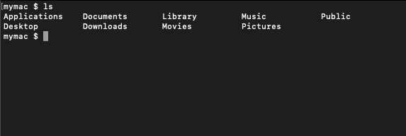
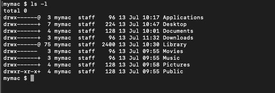
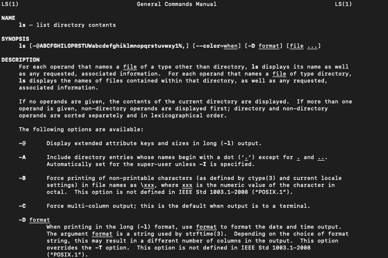
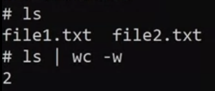
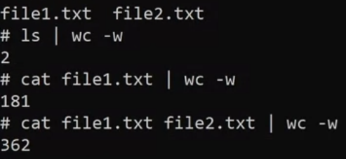
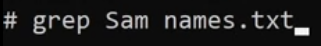
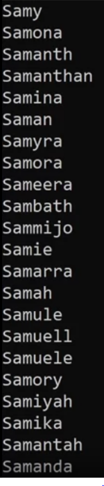
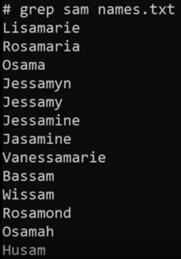
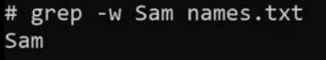
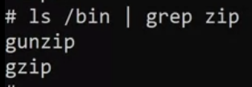

# Unix Commands

The term "shell" refers to a program that provides a command-line interface for interacting with an operating system. Bash (Bourne-Again SHell) is one of the most commonly used Unix/Linux shells and is the default shell in many Linux distributions.

People created new shells that met their needs better. Multiple shells exist today because some meet specific needs better than others.

Bash shell is a command-line interface, The reason there are different shells, is that the original Unix shell 'sh' was very limited. 

 

| Command | Used for |
| :---:   | :---: |
| cd direcrory-name | Change Directory |
| cd .. | Previous Directory |
| cd / | go back to the root |
| touch | Create a new empty file or to update a timestamp on a file |
| cp | Used to make a copy of a file or folder |
| mkdir | Make a new directory |
| ls | Showing the content of a directory |
| rm | Removing a file or a directory |
| mv | Move files or folders to another location |
| pwd | Shows the current location in the shell |
| cat | Allows reading or concatenation (combine the output) of multiple files |
| less | Displays the contents of a file one page at a time |
| grep | Allows for searching contents of files or folders |
| wc file-name -w | Word count |

 

### Flags :

    Every bash command has flags for changing the output of the command itself. For example, the ls command prints out the list of contents inside a directory. If we wanted to show the list in a different view, we simply need to add a flag such as ls -l.

  

    When the flag of -l is passed, it will show the output differently

  

### Man Pages :

    When first learning commands from bash, it can feel a bit daunting. Luckily, every command has its manual (or man pages for short). The man page lists all the flags and options that a particular command has to offer. 

  

### Pipes :

Pipes help to pass the output of one command to another (combine commands)

    pipes the output of ls to wc -w
    which results of counting 2 files 

 

    pipes the output of cat file1.txt which would be the content of the file to wc -w which will count how many words in the file
    you can also use 2 files file1.txt file2.txt the output of these 2 files have been combined and the result is 362 word

  

### Grep 
used to search in the content of a file and its case sensitive

    search for a name that starts with Sam

    Output

    if we searched for sam not Sam 

### note : we can use the flag grep -i to ignore sensitivity
 

    for exact match we can use grep -w

    we can use grep with pipes!! here we used grep to filter the results and got a name that starts with zip

